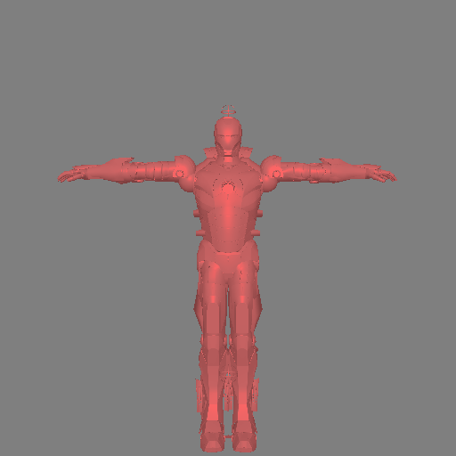
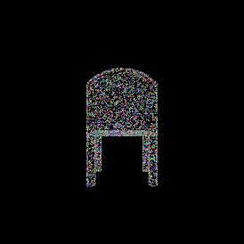
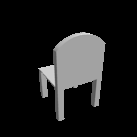
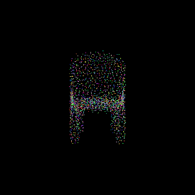
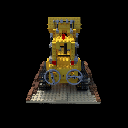
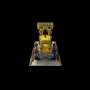

# Learning 3D Computer Vision

3D computer vision enables us to understand the spatial arrangement, orientation, shape,
and volumetric characteristics of objects in the 3D world, leading to high-level
semantic insights. This repository is dedicated to tutorials on 3D computer vision,
focusing solely on learning-based methodologies, particularly with neural networks.

## Table of Contents

### [3D Object Representations](https://htmlpreview.github.io/?https://github.com/lionlai1989/Learning-3D-Computer-Vision/blob/master/3D_Object_Representations/3D_Object_Representations.html)

This notebook introduces common formats for representing 3D objects, including meshes,
point clouds, and voxels. It demonstrates how to use PyTorch3D for rendering these
representations, as illustrated below:

<div style="text-align:center">
  
  
  
  <p style="font-size: 14px; color: #777;">Left: meshes. Middle: point clouds. Right: voxels.</p>
</div>

### [Supervised Single-View to 3D Objects](https://lionlai1989.github.io/supervised-single-view-to-3d-objects/)

3D reconstruction from a single view is very similar to the process through which we
recognize objects in the real world. When we look at a chair from one angle, we know it
is a chair and can intuitively imagine what it would look like from other angles. It’s
not like a chair viewed from one angle will look like an airplane from another angle.
That being said, if you were determined to design an airplane that looks like a chair
from a specific viewpoint, then everything in this post is inapplicable. 🤣

<div style="text-align:center">
  
  
  
  <p style="font-size: 14px; color: #777;">Left: Ground truth point cloud. Middle: Single view image. Right: Predicted point cloud.</p>
</div>

### [Anatomy of NeRF, Neural Radiance Field](https://lionlai1989.github.io/anatomy-of-nerf/)

Neural Radiance Fields (NeRF) is a revolutionary approach to computer graphics and
vision for synthesizing highly realistic images from sparse sets of images. At its core,
NeRF models the continuous volumetric scene function using a multi-layer perceptron
(MLP), mapping spatial coordinates and viewing directions to color and density. In this
tutorial, I aim to demystify NeRF, explaining NeRF in detail and implementing it using
PyTorch from scratch.

<div style="text-align:center">
  
  
  <p style="font-size: 14px; color: #777;">Left: A sequence of training images. Right: Synthesized views under continuous viewing directions.</p>
</div>

### [Deep Dive into 3D Gaussian Splatting]()

Work in progress.

## Getting Started

All the results can be reproduced by following the instructions below.

### System Dependencies

-   NVIDIA driver, CUDA Toolkit, and cuDNN libraries: The system must installed recent
    NVIDIA driver, CUDA Toolkit, and cuDNN libraries, which are prerequisites for
    PyTorch and PyTorch3D. Here are the software versions which have been tested:

    ```none
    NVIDIA driver: 530.30.02
    cuda toolkit: 12.1
    cudnn: 8.9.7
    ```

    If you encounter any problems while installing or updating them, you could consult
    [this guide](https://lionlai1989.github.io/nvidia-gpu-setup-guide/).

-   Python3: `Python 3.10` is used throughout all the developments for the problems.

### Install Python and NVIDIA requirements

-   Create and activate a Python virtual environment named `venv_3d_cv`, and update
    `pip`, `setuptools`, and `wheel`:

    ```shell
    python3.10 -m venv venv_3d_cv \
    && source venv_3d_cv/bin/activate \
    && python3 -m pip install --upgrade pip setuptools wheel
    ```

-   Install required general Python packages:

    ```shell
    python3 -m pip install -r requirements.txt
    ```

-   Install required NVIDIA Python packages:

    ```shell
    python3 -m pip install nvidia-pyindex && python3 -m pip install -r nvidia_requirements.txt
    ```

### Install PyTorch and PyTorch3D

-   Please visit the PyTorch official website to find the command to use for your
    system:

    ```shell
    python3 -m pip install torch torchvision torchaudio
    ```

-   The installation guide of PyTorch3D can be found
    [here](https://github.com/facebookresearch/pytorch3d/blob/main/INSTALL.md):

    ```shell
    python3 -m pip install fvcore iopath && python3 -m pip install "git+https://github.com/facebookresearch/pytorch3d.git@stable"
    ```

### Running Jupyter Notebook

Now you are ready to go to each folder and run the python script and the Jupyter
Notebook. Please remember to select the kernel you just created in your virtual
environment `venv_3d_cv`.

## Acknowledgments

This repository is a compilation of materials gathered from various online sources, each
cited to acknowledge their origin.
